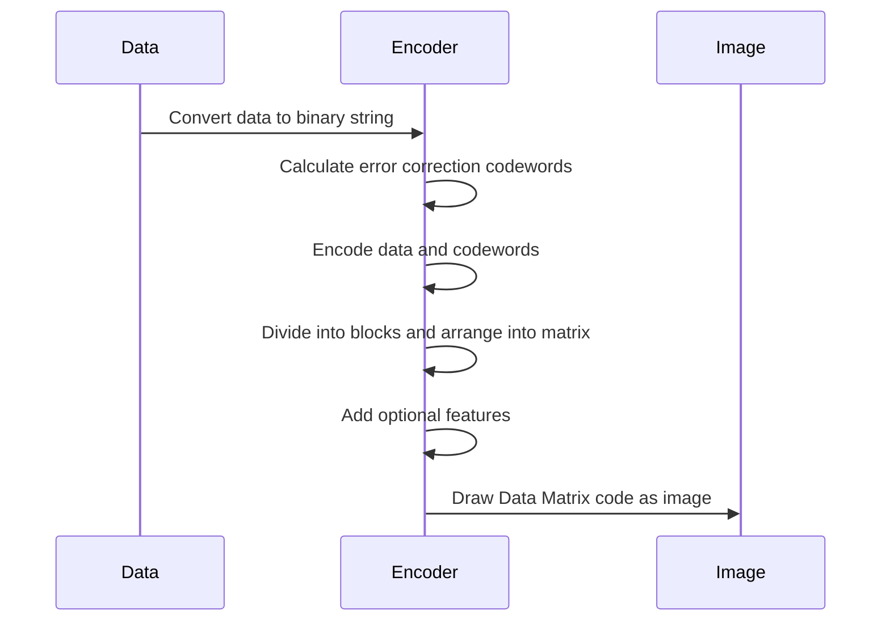

# Creating data matrix encoder

## Proposition

1. Choose the data that you want to encode in the Data Matrix code. This can be any type of data, such as text, numbers, or binary data.
2. Convert the data into a binary string, if it is not already in that form. The Data Matrix code uses a series of 1s and 0s to represent the data, so you will need to convert your data into this format.
3. Calculate the number of error correction codewords that are needed to ensure the reliability of the Data Matrix code. The ECC 200 variant of Data Matrix codes uses a high level of error correction, which means that it can tolerate a relatively high number of errors or damage to the code without losing its ability to be read.
4. Encode the data and error correction codewords using an error-correction encoding algorithm. There are several algorithms that can be used for this purpose, such as Reed-Solomon coding or BCH coding.
5. Divide the encoded data into blocks, and arrange the blocks into a matrix according to the Data Matrix standard. The Data Matrix code consists of a grid of black and white cells, with the encoded data represented by the patterns of black and white cells.
6. Add the optional features of the Data Matrix code, such as the finder patterns and the separator patterns. These features help the reader to locate the code and to determine its orientation.
7. Draw the Data Matrix code as an image, using a library or tool that supports Data Matrix codes. There are several libraries and tools available for this purpose, including the ones that I mentioned earlier (pyBarcode, pyzxing, etc.).

## Sequence Diagram

### Calculate error correction codewords

To calculate the error correction codewords for a Data Matrix code, you can use an error-correction encoding algorithm such as Reed-Solomon coding or BCH coding. These algorithms are designed to add redundant information to the data, which can be used to detect and correct errors that occur when the code is read.

Here's a general outline of the steps involved in calculating the error correction codewords using Reed-Solomon coding:

1. Determine the number of error correction codewords that are needed. The number of codewords depends on the size of the Data Matrix code and the error correction level (ECC) that you want to use. For example, the ECC 200 variant of Data Matrix codes uses 200 error correction codewords.
2. Divide the data into blocks of a fixed size. The size of the blocks depends on the number of error correction codewords that are needed.
3. Generate the generator polynomial for the Reed-Solomon code. The generator polynomial is a polynomial function that is used to calculate the error correction codewords.
4. Calculate the error correction codewords for each block of data. To do this, you can evaluate the generator polynomial at specific points and use the resulting values as the error correction codewords.
5. Append the error correction codewords to the data. The data and error correction codewords are combined to form the final encoded data, which will be used to create the Data Matrix code.
